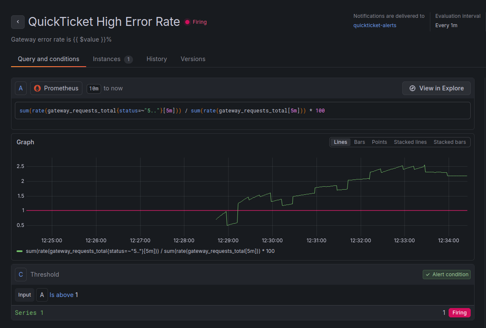

# Task 1
### 1. Your alert rule PromQL queries (both rules)
- **QuickTicket High Error Rate**
	`sum(rate(gateway_requests_total{status=~"5.."}[5m])) / sum(rate(gateway_requests_total[5m])) * 100`
- **QuickTicket SLO Burn Rate**
	`(1 - (sum(rate(gateway_requests_total{status!~"5.."}[30m])) / sum(rate(gateway_requests_total[30m])))) / (1 - 0.995)`

### 2. Contact point type and evidence of notification received (webhook URL output or screenshot)
`{`
  `"receiver": "quickticket-alerts",`
  `"status": "firing",`
  `"alerts": [`
    `{`
      `"status": "firing",`
      `"labels": {`
        `"alertname": "QuickTicket High Error Rate",`
        `"grafana_folder": "quickticket",`
        `"severity": "critical"`
      `},`
      `"annotations": {`
        `"description": "Error rate exceeded 5% for 2 minutes. Check payments service health.",`
        `"summary": "Gateway error rate is 2.0698667593692837%"`
      `},`
      `"startsAt": "2026-06-26T12:32:00Z",`
      `"endsAt": "0001-01-01T00:00:00Z",`
      `"generatorURL": "http://localhost:3000/alerting/grafana/dfq7uyxpi46ioc/view?orgId=1",`
      `"fingerprint": "729dbc6aa3123de7",`
      `"silenceURL": "http://localhost:3000/alerting/silence/new?alertmanager=grafana&matcher=__alert_rule_uid__%3Ddfq7uyxpi46ioc&matcher=severity%3Dcritical&orgId=1",`
      `"dashboardURL": "",`
      `"panelURL": "",`
      `"ruleUID": "dfq7uyxpi46ioc",`
      `"values": {`
        `"A": 2.0698667593692837,`
        `"C": 1`
      `},`
      `"valueString": "[ var='A' labels={} type='query' value=2.0698667593692837 ], [ var='C' labels={} type='threshold' value=1 ]",`
      `"orgId": 1`
    `}`
  `],`
  `"groupLabels": {`
    `"alertname": "QuickTicket High Error Rate",`
    `"grafana_folder": "quickticket"`
  `},`
  `"commonLabels": {`
    `"alertname": "QuickTicket High Error Rate",`
    `"grafana_folder": "quickticket",`
    `"severity": "critical"`
  `},`
  `"commonAnnotations": {`
    `"description": "Error rate exceeded 5% for 2 minutes. Check payments service health.",`
    `"summary": "Gateway error rate is 2.0698667593692837%"`
  `},`
  `"externalURL": "http://localhost:3000/",`
  `"appVersion": "13.0.1",`
  `"version": "1",`
  `"groupKey": "{}/{__grafana_autogenerated__=\"true\"}/{__grafana_receiver__=\"quickticket-alerts\"}:{alertname=\"QuickTicket High Error Rate\", grafana_folder=\"quickticket\"}",`
  `"truncatedAlerts": 0,`
  `"orgId": 1,`
  `"title": "[FIRING:1] QuickTicket High Error Rate quickticket (critical)",`
  `"state": "alerting",`
  `"message": "**Firing**\n\nValue: A=2.0698667593692837, C=1\nLabels:\n - alertname = QuickTicket High Error Rate\n - grafana_folder = quickticket\n - severity = critical\nAnnotations:\n - description = Error rate exceeded 5% for 2 minutes. Check payments service health.\n - summary = Gateway error rate is 2.0698667593692837%\nSource: http://localhost:3000/alerting/grafana/dfq7uyxpi46ioc/view?orgId=1\nSilence: http://localhost:3000/alerting/silence/new?alertmanager=grafana&matcher=__alert_rule_uid__%3Ddfq7uyxpi46ioc&matcher=severity%3Dcritical&orgId=1\n"`
`}`

### 3. Your runbook (full text)
# Runbook: QuickTicket High Error Rate

## Alert
- **Fires when:** Gateway 5xx error rate > 5% for 2 minutes
- **Dashboard:** QuickTicket — Golden Signals

## Diagnosis
1. Check which service is failing:
   - `curl -s http://localhost:3080/health | python3 -m json.tool`
2. Check payments service directly:
   - `curl -s http://localhost:8082/health`
3. Check events service:
   - `curl -s http://localhost:8081/health`
4. Check logs for errors:
   - `docker compose logs gateway --tail=20 --since=5m`
   - `docker compose logs payments --tail=20 --since=5m`

## Common Causes
| Cause | How to identify | Fix |
|-------|----------------|-----|
| Payments service down | health shows payments: down | Restart: `docker compose start payments` |
| Payments high failure rate | health OK but errors in logs | Check PAYMENT_FAILURE_RATE env var |
| Events service down | health shows events: down | Restart: `docker compose start events` |
| Database connection exhausted | events logs show pool errors | Restart events, check DB_MAX_CONNS |

## Escalation
- If not resolved in 10 minutes, escalate to: [instructor/TA]

###  4. Alert firing evidence: Grafana alert rule status showing "Firing"
The alert rule successfully transitioned to the **Firing** state after the metrics sustained an elevated error rate above the 1% threshold for the required 2-minute pending duration. 
**Evidence Validation:** 
* The global alert rule status has successfully transitioned to the **Firing** state (indicated by the pink badge in the header). 
* The Prometheus query `sum(rate(...))` captures a gateway error rate fluctuating between **~1.5% and 2.5%**, which consistently violates the configured threshold (`Is above 1`). 
* The condition evaluation loop has completed its `for: 2m` pending check, validating that this is a persistent infrastructure failure rather than a temporary metric spike.

### 5. Timeline: when you injected → when alert fired → when you diagnosed → when you fixed → when alert resolved
| Timestamp (UTC) | Event                              | System State / Metrics                                                                                               |
| :-------------- | :--------------------------------- | :------------------------------------------------------------------------------------------------------------------- |
| **12:28:26**    | **Failure Injection**              | Restarted `payments` service with `PAYMENT_FAILURE_RATE=0.5`.                                                        |
| **12:29:13**    | **Threshold Crossed (Pending)**    | Gateway error rate metric metric scaled up and breached the **1%** threshold. Alert transitioned to `Pending` state. |
| **12:31:13**    | **Internal Alert Firing**          | The error rate sustained above the threshold for the entire duration of the configured `Pending period` (**2m**).    |
| **12:32:31**    | **Alert Notification Received**    | Webhook target registered the `Firing` notification. Actual gateway error rate at evaluation: **2.07%**.             |
| **12:37:00**    | **Internal Alert Resolution**      | Error rate dropped to **0.93%** (below the 1% threshold) after the failure rate was restored.                        |
| **12:37:32**    | **Recovery Notification Received** | Webhook target registered the `Resolved` notification.                                                               |
*Threshold was decreased to 1% because with `PAYMENT_FAILURE_RATE=0.5`, metric wasn't higher than threshold(wasn't higher than 5)*
### 6. Answer: "How long from failure injection to alert firing? Why the delay?"
The total delay from failure injection (**12:28:26**) to the webhook notification (**12:32:31**) was **3 minutes and 5 seconds**. This delay is accumulated across three pipeline stages: 
1. **Metrics Ramping (~47s):** Prometheus scrapes data discretely, and the `rate(...[5m])` rolling window requires time to statistically compound new 5xx errors and force the graph past the 1% threshold (breached at **12:29:13**). 
2. **Pending Period (2m 00s):** A mandatory buffer configured via `for: 2m` to prevent alert fatigue from transient, self-healing metric spikes. The alert transitioned to internal firing at **12:31:13**. 
3. **Evaluation & Notification Loop (~1m 18s):** Introduced by the discrete `Evaluation interval: Every 1m` rule check and internal Alertmanager buffering/flushing intervals (`group_wait`) before dispatching the JSON payload.

# Task 2
# Postmortem: QuickTicket Gateway High Error Rate Due to Payment Service Failure

**Date:** 2026-06-26  
**Duration:** 12:28:26 UTC → 12:37:00 UTC (8 minutes, 34 seconds)  
**Severity:** SEV-2  
**Author:** Nikita Sergeevich  

## Summary
A simulated 50% failure rate injection in the `payments` service caused a cascading degradation across the application infrastructure, forcing the API gateway to return `502 Bad Gateway` errors for affected requests. The incident impacted approximately 2.07% of overall gateway traffic for nearly 9 minutes, triggering a critical alert and consuming a portion of the service's error budget before the automated recovery loop restored operations.

## Timeline
| Time | Event |
|------|-------|
| 12:28:26 | **[Failure Injected]** Infrastructure configuration updated, restarting the `payments` container with a 50% systematic failure rate. |
| 12:29:13 | **[First Symptom]** The 5-minute rolling window metric `sum(rate(gateway_requests_total{status=~"5.."}[5m]))` breached the 1% threshold, transitioning the alert rule to `Pending`. |
| 12:31:13 | **[Alert Fired]** The `for: 2m` watch duration expired; the alert status internally transitioned to `Firing`. |
| 12:32:31 | **[Investigation Started]** High-priority notification payload successfully received via the configured `quickticket-alerts` Webhook.site target. Logs inspection initiated. |
| 12:33:00 | **[Root Cause Identified]** Correlating Grafana metrics with historical container deployment logs isolated the upstream dependency error origin specifically to the `payments` container lifecycle event. |
| 12:35:00 | **[Fix Applied]** Configuration anomaly corrected; deployment state rolled back to eliminate the induced internal errors. |
| 12:37:00 | **[Service Recovered]** Moving average error metric fell below the 1% threshold boundary (`0.93%`), automatically transitioning the alert status to `OK`. |
| 12:37:32 | **[Alert Resolved]** Final `Resolved` notification successfully delivered to the webhook target, officially closing the incident lifecycle. |

## Root Cause
The `payments` downstream service failure rate environment parameter was configured to a systematic 50% rejection state. Because the API gateway directly orchestrates synchronous upstream actions to commit reservation states through this path, these unhandled dependency failures immediately translated into unhandled `502 Bad Gateway` bubbles at the edge router. The lack of proactive, graceful circuit-breaking and localized degradation strategies at the gateway level allowed upstream system strain to directly deplete the client-facing reliability budget.

## What Went Well
- The alerting rule configuration reacted deterministically, successfully flagging the service degradation within roughly 3 minutes of the fault injection.
- The webhook routing infrastructure worked perfectly, delivering structured, actionable JSON context packets to the target channel.

## What Went Wrong
- **High-latency debugging due to manual log inspection:** It took several attempts to filter the correct service logs (using `grep`) to correlate the gateway 502 errors with the specific `payments` service failure mode. 
- **Confusion during failure injection:** Multiple consecutive `docker compose` commands were needed to correctly apply and verify the `PAYMENT_FAILURE_RATE` environment variable, which caused temporary uncertainty about whether the failure was actively running or if the container had failed to restart.

## Action Items

| Action                                                                                         | Owner   | Priority |
| ---------------------------------------------------------------------------------------------- | ------- | -------- |
| Add `docker compose logs` command snippets to alert annotations for faster debugging           | Nikita  | High     |
| Document the exact command to verify `PAYMENT_FAILURE_RATE` in running containers              | Nikita  | Medium   |
| Create a simple checklist for `docker compose` service restart sequences to avoid input errors | Nikita  | Low      |

Answer: "What is the most important action item from your postmortem? Why?"

- Most important action: Implement a circuit breaker pattern at the gateway layer.

- Why: It decouples the gateway from failing dependencies. Instead of propagating 502 Bad Gateway errors to users, the system can provide a fallback response, preventing a single service failure from crashing the entire application and protecting the error budget.

